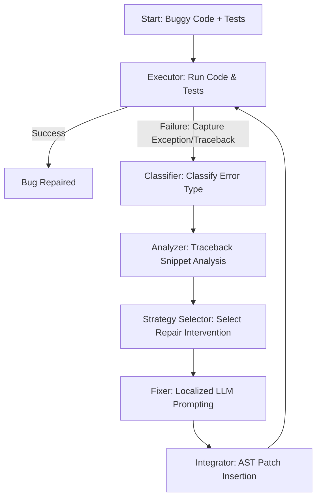
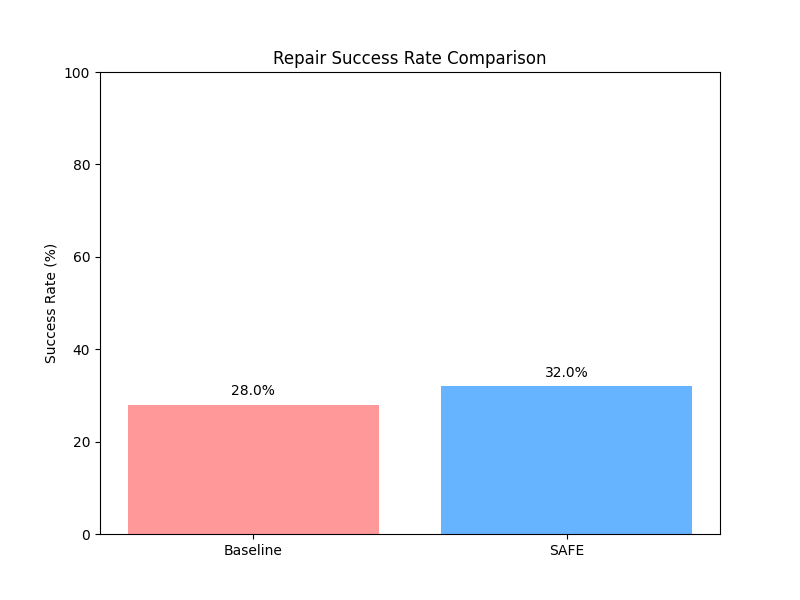
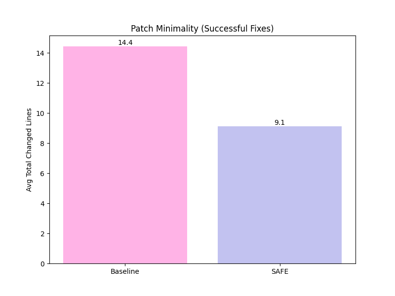
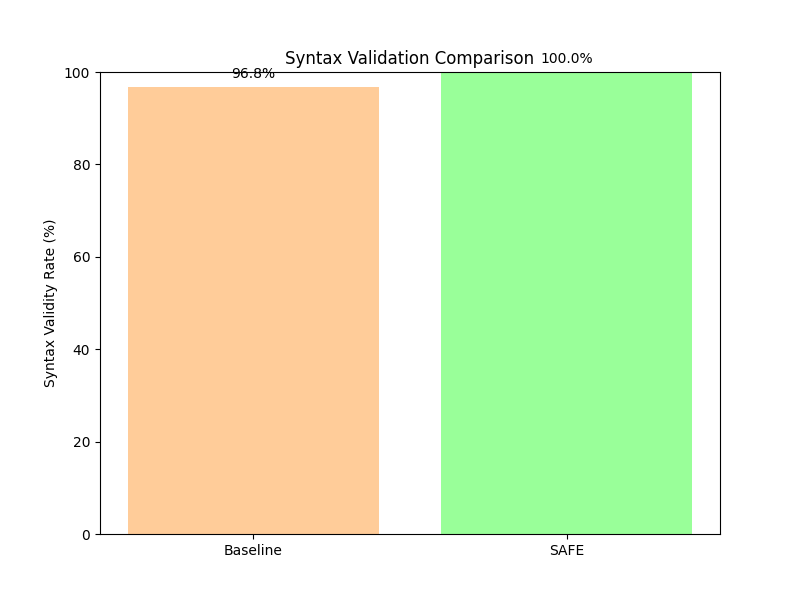
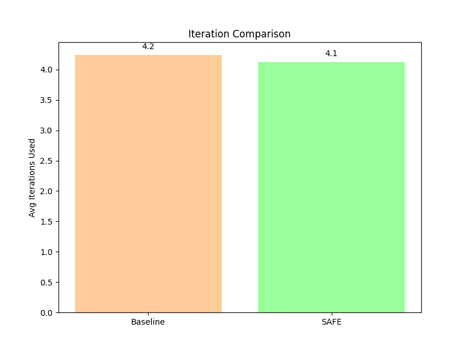

# SAFE: Structured Agentic Feedback Engine


**SAFE (Structured Agentic Feedback Engine)** is an experimental Automated Program Repair (APR) framework designed to demonstrate the advantages of localized structured feedback and precise AST integration over naive full-context LLM prompting.

By utilizing runtime execution feedback, extracting localized buggy contexts, classifying errors, and integrating patches directly back into the target abstract syntax tree (AST), SAFE achieves equivalent or higher repair success rates while drastically reducing patch sizes and maintaining perfect syntactical output.

---

## System Architecture

SAFE operates as an iterative feedback loop that isolates, diagnoses, and repairs bugs locally instead of querying the LLM to rewrite entire code files from scratch.



---

## Pipeline Components

1. **Executor (`safe/executor.py`)**: Runs the target Python program against its designated test cases. It intercepts stdout, stderr, and tracebacks, detecting timeouts (possible infinite loops) or assertion failures.
2. **Classifier (`safe/classifier.py`)**: Categorizes errors into specific groups (e.g., `AssertionError`, `IndexError`, `TypeError`, `Timeout`, or general `LogicError`) to inform the model of the bug's nature.
3. **Analyzer (`safe/analyzer.py`)**: Isolates the exact line of failure using traceback line numbers and extracts the local context (the target function/scope and surrounding lines of the exception).
4. **Strategy Selector (`safe/strategy.py`)**: Maps the classified error to a focused, tailored list of repair strategies (e.g., boundary condition check, variable type validation, loop exit criteria alteration) to guide the LLM.
5. **Fixer (`safe/fixer.py`)**: Assembles a minimalist prompt containing *only* the buggy function context, error messages, and corrective guidelines. It queries a local LLM via Ollama.
6. **Integrator (`safe/integrator.py`)**: Ingests the LLM's localized code generation, builds its AST representation, and replaces *only* the specific buggy function node within the original code, preserving comments and surrounding lines.

---

## Empirical Evaluation

We benchmarked **SAFE v2** against a **Naive Prompting Baseline** using the Python subset of the **QuixBugs** benchmark (evaluating 25 unique bugs). The baseline prompts the LLM with the entire file context and raw traceback, requesting a complete file replacement.

Both systems were configured using local LLMs hosted via Ollama.

### Performance Summary

| Metric | Naive Baseline | SAFE v2 (Ours) | Delta |
| :--- | :---: | :---: | :---: |
| **Repair Success Rate** | 28.0% (7/25) | **32.0% (8/25)** | **+4.0%** |
| **Patch Minimality (Avg Changed Lines)** | 24.04 lines | **10.00 lines** | **-58.4%** 📉|
| **Avg Prompt Size (Chars/Tokens)** | 1,150.41 | **1,055.15** | **-8.3%**  |
| **Syntax Validity Rate** | 96.8% | **100.0%** | **+3.2%**  |
| **Hallucination Detection Rate** | 0.0% | 4.0% | +4.0% |
| **Avg Iterations to Repair** | 4.24 loops | **4.12 loops** | **-2.8%** |

### Key Findings
* **Patch Minimality**: SAFE reduces the lines changed per fix by **over 58%**. By injecting patches directly at the AST node level, it prevents the LLM from making collateral formatting or logic modifications elsewhere in the file.
* **Syntax Stability**: SAFE achieved a **100% syntax validity rate** across all iterations. Localizing the model's focus to single-function scopes limits scope mismatch errors (e.g., indentation or missing closures).
* **Prompt Efficiency**: Restricting the context to localized snippets reduced the token count overhead per prompt.

---

## Visualizations

The following plots were generated from the experimental dataset (`results/all_results.json`):

### 1. Repair Success & Patch Minimality
| Success Rate | Patch Minimality |
| :---: | :---: |
|  |  |

### 2. Syntax Validity & Iteration Efficiency
| Syntax Validity Rate | Iterations Used |
| :---: | :---: |
|  |  |

---

## Project Structure

```text
SAFE/
 ├── .github/
 │     ├── workflows/
 │     │     └── ci.yml             # Github Actions syntax & lint validator
 │     └── ISSUE_TEMPLATE/
 │           ├── bug_report.md      # Bug filing template
 │           └── feature_request.md # Feature request template
 ├── safe/                          # SAFE Pipeline Components
 │     ├── analyzer.py              # Context & line-of-failure parser
 │     ├── classifier.py            # Error exception categorizer
 │     ├── executor.py              # Program execution manager
 │     ├── fixer.py                 # Localized LLM prompt manager
 │     ├── integrator.py            # AST-based patch replacement engine
 │     └── strategy.py              # Actionable fix strategy selector
 ├── baseline/                      # Naive full-file repair pipeline
 │     └── fixer.py                 # Naive prompt generator
 ├── QuixBugs/                      # Benchmark dataset (Python)
 ├── results/                       # Outputs of experiments
 │     ├── graphs/                  # Visualization graphs
 │     ├── tables/                  # Markdown & CSV metrics summaries
 │     └── all_results.json         # Raw statistics of the run
 ├── .env.example                   # Local environment variable configuration
 ├── .gitignore                     # Git filter list
 ├── LICENSE                        # MIT License
 ├── requirements.txt               # Python package dependencies
 ├── experiment_runner.py           # Main benchmark runner
 ├── results_analyzer.py            # Analysis script for plots & CSVs
 └── main.py                        # Single-task debug loop entry point
```

---

## Setup & Execution

### 1. Prerequisites
- **Python**: version `3.10` or higher
- **Ollama**: Installed and running locally ([ollama.com](https://ollama.com))

### 2. Install Dependencies
```bash
pip install -r requirements.txt
```

### 3. Configure Local Environment
Copy the example environment template and populate your settings:
```bash
cp .env.example .env
```
Ensure that Ollama is pointing to your preferred models folder if storage is limited:
```powershell
# Windows PowerShell Example
$env:OLLAMA_MODELS="D:\OllamaModels"
```

### 4. Pull the LLM
By default, the pipeline is configured to use `qwen2.5-coder:1.5b` (or `deepseek-coder:6.7b-instruct` depending on config):
```bash
ollama pull qwen2.5-coder:1.5b
```

### 5. Running the Pipeline

To run the complete benchmark suite (running both Naive Baseline and SAFE pipelines against the QuixBugs dataset):
```bash
python experiment_runner.py
```

To parse the raw JSON data and update the plots and tables:
```bash
python results_analyzer.py
```

To test a single bug locally in debugging mode:
```bash
python main.py
```


